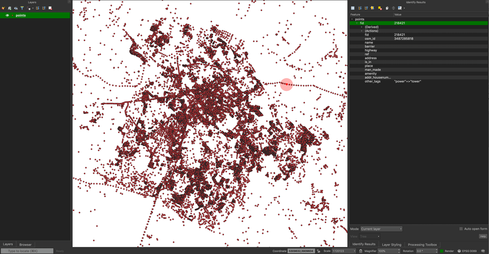
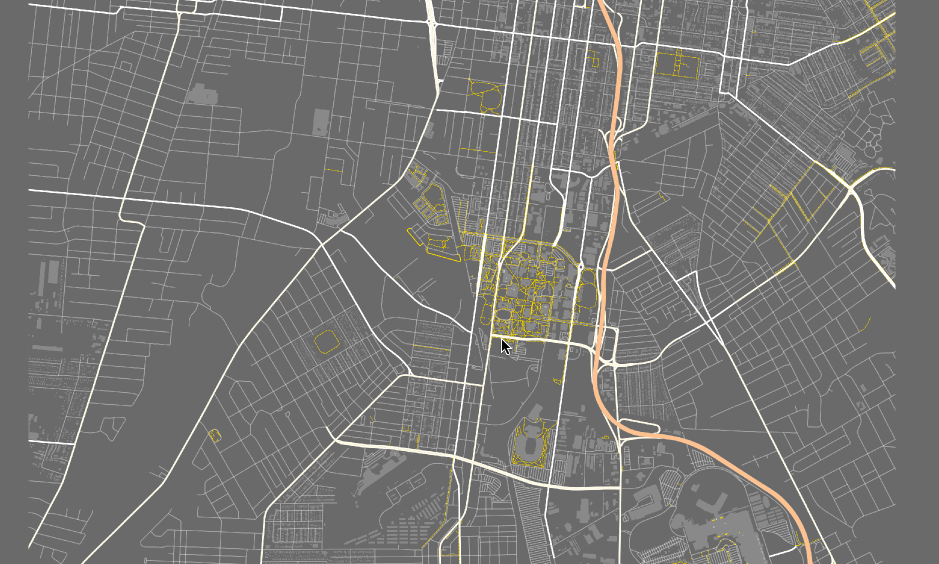
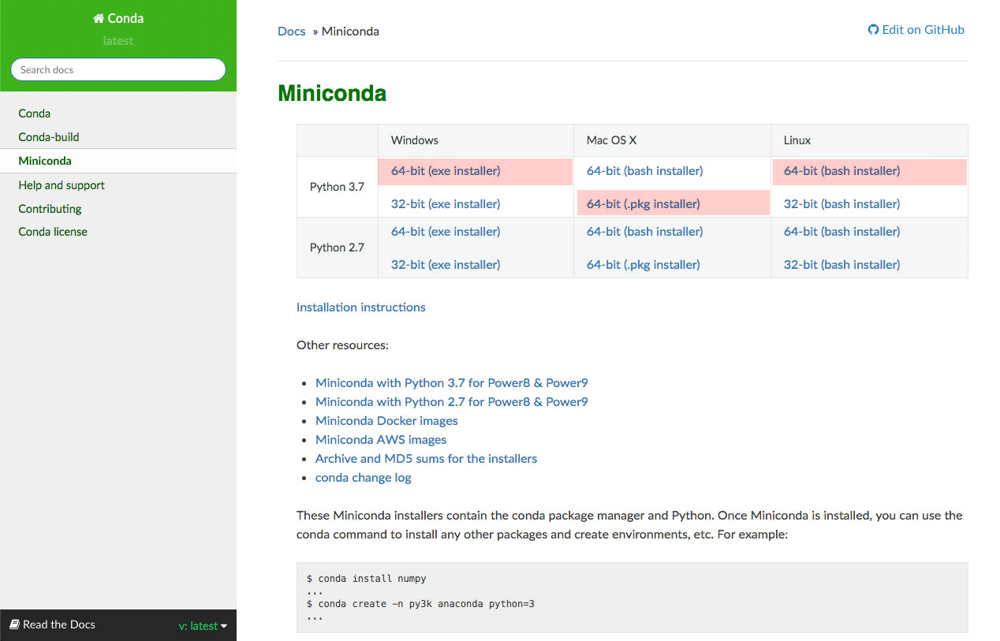

# OpenStreetMap Data and Introduction to Geoprocessing Tools


## Table of Contents

<!-- TOC -->

- [OpenStreetMap Data and Introduction to Geoprocessing Tools](#openstreetmap-data-and-introduction-to-geoprocessing-tools)
    - [Table of Contents](#table-of-contents)
    - [Overview](#overview)
    - [Data files](#data-files)
    - [OpenStreetMap](#openstreetmap)
        - [History of OSM](#history-of-osm)
            - [How accurate is the data?](#how-accurate-is-the-data)
            - [Why use open source data when we have Google Maps?](#why-use-open-source-data-when-we-have-google-maps)
        - [OpenStreetMap data structure](#openstreetmap-data-structure)
    - [Collecting OpenStreetMap data with QuickOSM](#collecting-openstreetmap-data-with-quickosm)
        - [Getting additional data](#getting-additional-data)
        - [Saving QuickOSM data](#saving-quickosm-data)
    - [Symbolizing OSM data](#symbolizing-osm-data)
        - [Data exploration for symbology](#data-exploration-for-symbology)
        - [Adding layer styles](#adding-layer-styles)
        - [Make a simple base map in QGIS](#make-a-simple-base-map-in-qgis)
    - [Introduction to Geoprocessing](#introduction-to-geoprocessing)
        - [Buffer analysis: find areas within distance of a feature](#buffer-analysis-find-areas-within-distance-of-a-feature)
        - [Location analysis: Distance to Nearest Hub](#location-analysis-distance-to-nearest-hub)
        - [Network Analysis: Service Area](#network-analysis-service-area)
    - [Optional: Advanced use and processing of OSM data](#optional-advanced-use-and-processing-of-osm-data)
        - [Command line interface (CLI)](#command-line-interface-cli)
            - [Basic command line utilities](#basic-command-line-utilities)
        - [Importing large OSM datasets](#importing-large-osm-datasets)
        - [Using OSM data in a PostGIS database](#using-osm-data-in-a-postgis-database)
            - [Example: Loading road styles statewide](#example-loading-road-styles-statewide)
            - [Example: buffer function](#example-buffer-function)
    - [Addendum I: Rule-based symbology](#addendum-i-rule-based-symbology)
        - [Add scale ranges to symbol layers](#add-scale-ranges-to-symbol-layers)
            - [Add scale ranges to turn on/off layers](#add-scale-ranges-to-turn-onoff-layers)
        - [Add Labels](#add-labels)
        - [Export Styles](#export-styles)
            - [OSM styles can be easily shared](#osm-styles-can-be-easily-shared)
    - [Addendum II: Installing and accessing GDAL](#addendum-ii-installing-and-accessing-gdal)
        - [Windows OS](#windows-os)
        - [Other operating systems](#other-operating-systems)
    - [References](#references)

<!-- /TOC -->

## Overview

After some time working with QGIS, we should have a solid foundation to venture into more complex projects. In previous modules, we've been using highly curated datasets with a specific theme. This lesson opens the door to reveal global-scale data and converges many different skill sets that help identify and understand real-world spatial relationships. Specifically, you will: 
* download live data from OpenStreetMap, a global, user-developed dataset with consistent, standardized attributes for symbology
* learn how to apply layer styles to OSM data that can change with scale and attribute
* perform spatial analysis using the buffer geoprocessing tool and other location analysis tools. While we'll use OSM data in this module, the geoprocessing and symbology techniques can be used on any data.


## Data files

* Harvested from OpenStreetMap via QGIS.
* Various layer style definitions in the repository [styles](styles) folder


## OpenStreetMap

We've run into [OpenStreetMap (OSM)](https://www.openstreetmap.org/) a few times in previous modules, but have not used it as a data source, yet. In the last module, you might have used OSM to practice digitizing and editing vector data. In this lesson, we'll download data from OSM, style it, and do a location analysis techniques using OSM data.

OpenStreetMap is the world's largest crowdsourced mapping project. It is a free, open-source, volunteer-generated global map that aims to be the "Wikipedia of maps" and global GIS data repository. As of February 2018 [OSM stats](http://www.openstreetmap.org/stats/data_stats.html), there were 4.8 million registered users and 6.1 billion GPS points uploaded. In May 2019, we have 5.4 million users and 7.3 GPS billion points.

### History of OSM

The OSM project started in the United Kingdom in 2004, with a single guy riding his bike through London collecting GPS data. The intent was to create an open-source map that could rival the government-made Ordinance Maps. As you can see in this [visualization](https://vimeo.com/31912114) of the first five years of map edits in the London area, progress was slow with users adding tiny pieces of the map as they collected the data themselves. Compare this to the first five years of [American map edits](https://vimeo.com/51341994). In the United States, US Census TIGER data, which is public data and we have used in previous modules, was able to be added to the map, filling it in rather quickly. If you watch the video closely, you'll see little flashes as county and state level data are brought in in large chunks.

Another interesting way to visualize OpenStreetMap is this [map](http://bl.ocks.org/lxbarth/raw/6545162/#2/30/-10) by [Alex Barth](https://github.com/lxbarth), which uses color to group the edits made to the map by each user. [Show Me the Way](http://osmlab.github.io/show-me-the-way/) lets you view real-time edits to OSM. The purpose here is to illustrate that OSM is a gigantic and dynamic data source.

#### How accurate is the data?

OSM has emerged as the best single source for consistent, well-attributed global vector data to use in your mapping project. Crowdsourcing relies on the wisdom of the crowd, which it turns out is pretty reliable. It appears that those amateurs aren't so amateur after all (Brabham, 2012). Research has shown that OSM maps are comparable in accuracy and quality to government-made maps (Haklay, 2010). The OSM user community is hyper-vigilant against map vandalism &ndash; the intentional addition of incorrect or false information to the map &ndash; to the point of it being one of the few ways that a user can be banned from using OSM. Google Map Maker, Google's attempt to recreate the ethos of OSM, is [not so good at this](http://www.independent.co.uk/life-style/gadgets-and-tech/news/google-map-maker-suspended-after-it-was-used-to-draw-androids-urinating-on-apple-logo-10244031.html).

The biggest liability in OSM data isn't its accuracy, but rather it's potential myopathy. While a good deal of the background map data in the US comes from the government sources, the more local knowledge (business names, bike trails, etc.) are created by users who tend to map things they find interesting. Monica Stephens (2013) noted that this leads to the interests of the largely male, well-educated and overwhelmingly German user-base dominating the map. (Check out Monica's SheepCamp presentation ["Guns, Germans and OpenStreetMap."](https://vimeo.com/44870758))

To be clear, maps have always been biased by the interests and cultural norms of their makers (Harley, 1989) and this is not unique to OSM. The data is accurate but potentially limited by who makes it (Haklay, 2013). In OSM, that's potentially 5+ million data makers contributing their interests.


#### Why use open source data when we have Google Maps?

First and foremost, if we can see it on [OpenStreetMap.com](https://www.openstreetmap.org), we can download, modify, and freely make maps in QGIS. We can even sell those maps. OSM is licensed under a [Creative Commons Attribution-ShareAlike 4.0 license](https://creativecommons.org/licenses/by-sa/4.0/) (CC BY-SA). OSM grants users the right to use their map data for free so long as [they attribute the data to OSM](https://www.openstreetmap.org/copyright) by applying the following credit to any product that uses OSM data:
 
```
© OpenStreetMap contributors
```

A [Google Maps license](http://www.google.com/permissions/geoguidelines.html) is much more restrictive. Google Maps does have amazing imagery, both satellite and on-the-ground via StreetView that can be used for base maps, but we cannot harvest vector data as we can in OSM. License restriction prevent using Google imagery at full resolution.

Perhaps the most compelling reason to use OSM data is the scale of information you can access. If you want vector lines for Seattle parks, then OSM is a great first choice if you don't know where to turn. Let's say you want to map networks that cross state and country boundaries? You can download OSM data by state, region, and world, all of which are updated everyday. In the below image, highways with select attributes are shown for the eastern US and Canada. 

     
*Eastern US and Canadian highways with select attributes*


### OpenStreetMap data structure

OSM has a basic data structure with a few [important elements](http://wiki.openstreetmap.org/wiki/Elements). The _node_, or coordinate point, is the basic geographic object. A node represents a specific point on the earth's surface. Each node comprises at least an id number and a pair of coordinates. Nodes can be combined into _ways_; an open way is a polyline and a closed way is a polygon. OSM data uses only WGS84 coordinates. _Relations_ group geographic objects in familiar relationships, such as routes (bus routes in a city) and multi-polygons (many closed ways belong to the same group).

You will not go far using OSM data without understanding its *tags*, the *key=value* pair definitions used to add meaning to geographic objects. For example, we could use the following query to find all highway lines that are [motorways](https://wiki.openstreetmap.org/wiki/Tag:highway%3Dmotorway) (the highest-performance roads within a territory that are generally limited access), with the query `"highway" = 'motorway'`. Presto! You have the interstate system in North America. Using familiar QGIS Filter statements, we can easily filter large datasets to map precisely what we want. 

For standard tag meaning, you should reference the [OSM wiki for specific key values](http://wiki.openstreetmap.org/wiki/Map_Features). These are all the items with which a user may tag an object in the OSM editor. Another similar resource is [TagFinder](http://tagfinder.herokuapp.com/) which is modeled as a search engine to find specific tags. The [TagInfo site](https://taginfo.openstreetmap.org/) is companion resource for looking at statistics of tag usage. Get to know the tags that interest you so that you can find data when necessary.

## Collecting OpenStreetMap data with QuickOSM

The **QuickOSM** plugin was develop to query these OSM tags and download/process moderate amounts of OSM data for use in QGIS. The plugin is installed via the **Plugin Manager**. Once installed, you can access the plugin via the **Vector** menu drop-down or with the green icon in QGIS's toolbar. The plugin has a detailed help documentation. If you find errors using this plugin, you likely are trying to pull down too much data. That usually is your cue to move to the command line interface, which is discussed later in the module.


This plugin offers one of the easiest methods for harvesting OSM data. QuickOSM will allow you download OSM vector layers by location name, extent of map canvas, and extent of a layer. This plugin uses the [Overpass API](http://wiki.openstreetmap.org/wiki/Overpass_API) and has a convenient link to OSM's [Help with key/value website](http://wiki.openstreetmap.org/wiki/Map_Features). 

First, let's zoom to an area of interest for which you are very familiar, such as your hometown, to download data. This demonstration will use Lexington, Kentucky. Previously, we loaded several base maps using QGIS's Python interface. If you did this, you should have several base maps available in your **XYZ Tiles** library. Add *Esri Standard* to your QGIS map. If you don't see this base map,  load it by navigating to **Browser Panel > XYZ Tiles**, right-click, and add the Esri Standard base map via the URL:
```txt
https://server.arcgisonline.com/ArcGIS/rest/services/World_Street_Map/MapServer/tile/%7Bz%7D/%7By%7D/%7Bx%7D
```

   
*Area of interest should be around 1:50,000 - 60,000 scale*

If your area of interest is too large, the QuickOSM plugin might stall or timeout trying to download the large expanse of data. Aim for a scale no smaller than 1:50,000 but it really depends on the density of data in your area.

Now, let's make a query and download our layers. The goal is to not query too much data at once. It's hard to say what the limit is, but you'll know it when you see it. Add a polygon feature, such as the county containing your area of interest. In this lesson, I'm using Fayette County, Kentucky. Select **Quick Query** and set the **Extent of a layer** to your polygon and select the **Highway** as your Key. Leave the **Value** dropdown empty, which will select all types of highways:

   
*Download highway OSM data for the extent of a layer*

Then hit **Run query** and it should populate your Layers Panel with point, line, and polygon vector data for the key 'highway.' We can easily identify highways as line features, but what about points and polygons? Explore the attribute table, select a record, and **Zoom to selected feature** to inspect the feature.


*Examine a highway polygon feature*

Use the **Identify** tool to view attributes of individual features. Select the layer you want to explore in the Layers Panel and click a feature in the layer on the Map Canvas. If you double-click the feature, you should find a popup window listing all of the key/values for that feature.

### Getting additional data

QuickOSM needs to be queried mutliple times to get the desired layers. Here's the info for the layers we want to grab:
- **Streets, roads and highways:**
  - Key: highway
  - Value: *Empty*
  - Geometry layer to keep: line
- **Lakes and ponds:**
  - Key: natural
  - Value: water
  - Geometry layer to keep: polygon
- **Rivers and streams:**
  - Key: waterway
  - Value: stream
  - Geometry layer to keep: line
- **Buildings (*Available in most but not all areas*):**
  - Key: building
  - Value: *Empty*
  - Geometry layer to keep: polygon 
- **Parks:**
  - Key: leisure
  - Value: park
  - Geometry layer to keep: polygon
- **Amenities:**
  - Key: amenity
  - Value: *Empty*
  - Geometry layer to keep: point

Use the **Key** and **Value** dropdown menus to download these layers.

If you keep adding layers from QuickOSM, you could quickly make a map very similar to OpenStreetMap; in fact, you have access to the entire database (more on that in a moment). You can sort through the key=value relationships and identify the attribute you wish symbolize; you have no limit on the type of map you can make. However, we need to employ a strategy to deal with the these temporary layers and their sprawling attribute tables.


### Saving QuickOSM data

QuickOSM is a convenient method to harvest data from OSM, but it only temporarily saves your layers as virtual layers. If you remove them from your Layers Panel, they will be deleted. In this menu-based workflow, save your QuickOSM query as a GeoPackage. 

First, we need to deal with the QuickOSM attribute tables, primarily the vast number and spelling of field names. The plugin brings done all attributes for a key, most of which are empty. Also, some attributes are the same name but differ in case, e.g., *floors* and *Floors* in the building key. Open the **Processing Toolbox** and search for "Drop fields." This tool will allow us to prune unnecessary fields in our temporary layers before we save them as permanent layers.

     
*Drop fields excessive number of fields*

Click **Select All** (selected fields are dropped) and the unselect the first 12, or so, field names. The top fields are generally the most useful. The exact number is up to you, **except** keep the field name that's the same as the key name, e.g., for the *building* layer unselect **building**. Unselect the top *ID* fields and *name*, *type*, and any other interesting attribute you want to keep. Just make sure no fields share the same name and only vary in case.

Click **Run** and then **Close**. You will have a new layer in the Layers Pane called, *Remaining Fields*. This is the layer we want to save permanently. Because we will perform geoprocessing soon, we will project these layers as we save them. If you're working in Kentucky, then save it using the local CRS, e.g, EPSG: 3089. If you're working in a different area, select the appropriate CRS for your region.

     
*Saving OSM data as a GeoPackage*

Use a unique name to differentiate from the QuickOSM layers. Do not save them in your GitHub repository. Perhaps save them in distinct folder that identifies them as projected layers from OSM.

After pruning the fields and saving the layers, remove the QuickOSM layers and base map. Save the QGIS project file. You should have something similar to this screenshot.


     
*Preparing for symbology and geoprocessing*


## Symbolizing OSM data

It quickly becomes obvious that OSM data has a lot of attributes one might use for symbology. Thankfully, OSM has standardized many of the common tags. For example, the `highway` layer has a field called *highway* (the key) which contains the primary highway type (the value) and is consistent around the world. We can use rule-based styles to quickly filter, group, and symbolize our features. 

Most keys will have a dominant geometry feature type, e.g., highways are lines, as are railways and cycleways. Some keys have secondary feature types. Waterways are both polygons and lines. Dominant feature type in landuse is the polygon, while for amenity it is the point. Take a little time to explore the different geometry types for different keys in areas you know well. 

Let's symbolize line feature type for highways. Open the highway line layer properties **Style tab** and select **Categorized** method of symbology using the **highway** field:


If you double-click symbol type, you can add unique symbols for residential roads, motorways, trunk roads, etc. We need first to recognize how OSM orders the types, e.g., what is a trunk compared to primary highway? Let's look at the OSM wiki to explain the highway key: [http://wiki.openstreetmap.org/wiki/Key:highway](http://wiki.openstreetmap.org/wiki/Key:highway). This page gives us the definition of the key's value and its symbol on OpenStreetMap. We could labor to make this symbology via the **Categorized** method, but instead, let's leverage QGIS's **Rule-based** symbology which uses SQL to filter, symbolize, and label data 'on-the-fly' depending on the scale of the view and feature attributes.


### Data exploration for symbology

Before we apply rule-based symbology, let's summarize our data to better understand it. Since we have moved our data to a GeoPackage, we can use SQL. The GeoPackage use the SQLite database for its container and you have access to its dialect of SQL. (If you've been doing the PostGIS workflow, you should understand the [how SQLite differs](https://www.sqlite.org/omitted.html).)

First, we need to connect our database. Open the Browser Panel and right-click **GeoPackage > New Connection**. Navigate to your you highways *.gpkg* file and select it. This is the same process we have done in previous labs. After you've connected, open **DB Manager** from the QGIS menu item, **Database > DB Manager**.

Expand the GeoPackage Database and let's count the number of different highway types. In the DB Manager menu, click **Database > SQL Window** and paste in the following SQL:

```sql
/* 
    Count and rank distinct highway types in your data.
    Table and field names should be enclosed in double quotes 
    if they contain dashes or spaces.
*/

select
    count(*) as count,
    highway
from
    -- ** Change this table name to your table name **
   "bluegrass-travel"
group by 
   highway
order by
    count desc
```

This query outputs the following:

   
*Count number of different highway types*


This summary tells us we have a lot of footway features, which in my case are mostly sidewalks. Now, compare that to all the other feature types. Symbolizing 20+ different types of highways and making it look good can be a daunting task. We could organize roads into five different types by querying out different groups:

* motorways
* primary roads
* secondary roads
* local roads
* pedestrian paths

Let's make a few queries that will group these types and count the total number.

```sql
/* Count motorways (limited access roads) */
select
    count(*) as "count",
    "highway"
from
    -- ** Change this table name to your table name **
   "bluegrass-travel"
where
    "highway" = 'motorway'

/* Simple enough! */

```

Now our Primary roads using the `in` operator:

```sql
/* List primary roads (big roads and access ramps to motorways) */

select
    "highway",
	"name",
	"ref"
from
    -- ** Change this table name to your table name **
   "bluegrass-travel"
where
    "highway" IN ( 'motorway_link','trunk','primary')

```

Now secondary roads:

```sql

/* List secondary roads */

select
    "highway",
	"name",
	"ref"
from
    -- ** Change this table name to your table name **
   "bluegrass-travel"
where
    "highway" IN ( 'trunk_link','primary_link','secondary','secondary_link','road','tertiary','tertiary_link')
```

Local roads using the `not` in operator to select everything outside the other roads. You could explicitly say which are local roads, but if you have a lot of types you'll need to do more typing.

```sql

/* List local roads (roads not counted elsewhere) */

select
    "highway",
	"name",
	"ref"
from
    -- ** Change this table name to your table name **
   "bluegrass-travel"
where
    "highway" NOT IN ('motorway','motorway_link','trunk','primary','trunk_link','primary_link',
      'secondary','secondary_link','road','tertiary','tertiary_link',
      'cycleway', 'pedestrian','footway', 'steps', 'path', 'track'  )

```

Finally, list the pedestrian paths.

```sql
/* List pedestrian paths */

select
    "highway",
    "name",
    "ref"
from
    -- ** Change this table name to your table name **
   "bluegrass-travel"
where
    "highway" IN ('cycleway', 'pedestrian','footway', 'steps', 'path', 'track'  )
```

So in this way, we can query and filter our data to group similar features and give them the same symbology. In **DB Manager** expand **Virtual Layers > Project layers** and open a new **SQL Window**. Explore the other layers' attributes (no need to connect a new database). 


    
*Querying the distinct types in the building attribute*


### Adding layer styles

We have created layer styles that use queries like these to inform a rule-based method of symbolization. Look in the [styles](styles) folder in this repository and identify the files with the *.qml* file extension, (which were made in the demonstration shown in the below in *Addendum I*).   

Double-click the highway layer in the Layer Panel and click on the **Style** dropdown located at the lower-left corner of the window. Then, click on **Load Style...**

    
*Load external layer style*

Navigate to the [styles](styles) folder and select **roads.qml**. Access the layer's **Symbology** panel to see how we're using these queries. Click each rule and apply any desired changes to the symbols and/or scale range when these symbols appear. Don't worry about making mistakes, because you can always apply the **roads.qml** style again.

    
*Inspect and modify layer style*

Before you hit **Apply** check the **Labels** tab, click on the rule **Basic roads** and then the **Font** dropdown. Make sure you have this font or change it to a desired selection. 

    
*Inspect font type before hitting **Apply***

Hit **Apply** and notice the changes. Once you get a look that like, you can click **OK** to finish. You now have a slippy map where the symbols and labels change with scale. Apply the other *.qml* style files to the other layers. If you make significant changes to your layers' styles, make sure to save them to new *.qml* style files.


### Make a simple base map in QGIS

Let's make a simple base map showing highways, waterways (line and polygon), and parks from the leisure:parks (polygon), water from the natural key (polygon), and buildings (polygon). After you apply some queries and styles, your map might look like this:

  
*Styling layers in real-time using style dock*


You might find the window **Open layer styling dock** (located in the button row beneath the "Layers Panel" title) might help tweak your styles.


*Example of symbolized layers without building polygons*

We should have a nice base map, but where should we go from here? Let's add some analysis layers through geoprocessing.


## Introduction to Geoprocessing

Geoprocessing is broadly defined as a workflow of GIS functions, where each function has an input layer, a data manipulation procedure, and an output layer. QGIS calls the functions *algorithms* and [offers many useful tools](https://docs.qgis.org/3.4/en/docs/user_manual/processing_algs/qgis/index.html) that manipulate and analyze data. You might recognize a few of these tools if you have worked in GIS. Some of the fundamental tools you should be aware of are the [buffer](https://docs.qgis.org/3.4/en/docs/user_manual/processing_algs/qgis/vectorgeometry.html#buffer), [clip](https://docs.qgis.org/3.4/en/docs/user_manual/processing_algs/qgis/vectoroverlay.html#clip), [intersection](https://docs.qgis.org/3.4/en/docs/user_manual/processing_algs/qgis/vectoroverlay.html#intersection), and [dissolve](https://docs.qgis.org/3.4/en/docs/user_manual/processing_algs/qgis/vectorgeometry.html#dissolve). They will come in handy with your data wrangling needs. As you explore vector geoprocessing tools, focus on how a tool changes a layer's geometry *and* attribute table.


### Buffer analysis: find areas within distance of a feature

Let's take a look at a classic example using buffers. Imagine if you wanted to locate all parks within one mile of a cafe or mom. You first would want to know how far one mile is from each cafe. Using the buffer analysis, you input the point layer of cafe locations and the tool creates circular polygons with a radius of one mile around each point. Buffering lines and polygons extends the output polygon by a set distance perpendicular to the line segment of a line or polygon.

Under **Vector > Geoprocessing Tools** you'll find a drop-down menu containing a list of tools. This group of tools represent the common way you analyze spatial data by overlaying other layers.  

   
*Geoprocessing tools in QGIS*

Before we start, let's filter our amenities layer for *cafes*.

```sql
"amenity" = 'cafe'
```

If you applied the style, you should little coffee cups for your cafe symbol. QGIS ships with a library of SVG (Scaled Vector Graphics) images that makes a convenient symbol resource.

    
*Cafes symbolized with an SVG image of a coffee cup*

Launch the buffer tool. You have a couple parameters you need to set:

- The **Input layer**. Note that it shows the CRS for the layer. Is it EPSG 4236 or 4269? If so, you have the wrong layer.
-  The **Distance** determines how far the buffer will expand from the input vectors edge. There are several units options, inlcuding miles. We'll set this at 1.
-  The **Segments** option is the number of vertices per quarter of the buffer. The default five will result in a fairly blocky polygon, depending on your input shape. The maximum number you can input is 100, but around 20 results in a fairly smooth shape. This value also effects your processing time, and jumping up to 100 may take a while.
- **End cap style**, **Join style**, and **Miter limit** control how line endings and corners are handled. We'll leave these as their default values
-  The **Dissolve result** option is turned off by default. If enabled, all buffers are combined into a single, multi-part polygon and the attributes are dropped. If disabled, the attributes of the input are kept in the output. **Important Note**: if you have any geometry measures in the input, such as length, area, etc. they are not recalculated in the output layer.
-  The **Buffer** field is the output destination. For most scenarios, leave it as a temporary layer.

Let's make our first buffer:

   
*Buffer tool settings*

The tool should create a stack of circles showing areas within one mile of a cafe:

   
*Buffer tool output*

As we explored in the previous lessons, let's symbolize this polygon layer to imply density of areas served by cafes. Adjust the layer's style properties by adjusting the blending mode and transparency settings:

    
*Using buffer tool to show density of areas served*

Finally, we can have a few methods to find which parks intersect the buffers. We can see them,  of course, but we can't count them or summarized their attributes. We can use the **clip** tool, which extracts out the geometry of the parks that overlay the buffer polygons. Having parks cut into pieces might not yield the best visual representation. We could use the **intersection** tool. What would be the difference between these two geoprocessing tools? Run them both and compare the outputs.

Instead, let's select the entire park using the **Select by location** tool (found in QGIS's **Processing > Toolbox > Vector Selection** group) if is within 1 mile of a cafe. The tool only selects features (highlighted in the color yellow by default), so you would need to save the selection to a new layer. This example uses the *intersect* spatial condition. What would happen if we used the *contain* condition instead?

    
*Select by location*

By adding these geoprocessing and cartographic techniques we can visualize and find features within some distance of other features. Alternatively, and maybe more critically, we can show which areas don't have a desired feature nearby. This might seem trivial, but what if we were mapping areas within a mile of a bus stop? How far would you walk to catch a bus?


### Location analysis: Distance to Nearest Hub

Let's say we wanted find which park had the most cafes within one mile of the park's perimeter? We discovered in previous lessons that a spatial join could count the number of points in a polygon. But, we want preserve select attributes, like the names of the park and the cafe. 

Let's take a look at the **Distance to Nearest Hub (Line to Hub)** tool found in QGIS menu **Processing > Toolbox > Vector Analysis** group of tools. The line to hub analysis takes a point layer and draws a from each point to its closest feature in a destination layer. In our case, the destination layer is the park layer. 

    
*Distance to Nearest Hub tool parameters*

The **Hub layer name attribute** field should contain unique values, such as the name of the park. Typically, a city will not use duplicate park names. If duplicates do occur, then select the *ID* field, which will always be unique (do a table join after the tool runs to get all of the other attributes). The **Measurement unit** will measure how far the point is from the closest centroid (center of polygon). Output is a line layer with a good attribute table.

    
*Geometry output of Distance to Nearest Hub tool*

If we inspect the attribute table we find that we find each cafe gets two new fields, *HubName* (name of the park that's closest) and *HubDistance* (the distance in feet).

    
*Attribute output of Distance to Nearest Hub tool*

Let's open the QGIS menu **Database >DB Manager > Virtual Layers > QGIS Project** and run a query that summarizes our data. Let's group by park, count the number of cafes that are closest to each park, and find their average distance.

```sql
select 
	count(*) as count,
	avg(HubDist ) as "avg distance in feet",
	HubName
from 
	"Hub distance"
group by
	HubName
order by
    count desc
```

    
*Summary table of line to hub analysis*

Now we know which park has the most cafes nearby. Memorial Steps is likely to be a popular place on nice days!

### Network Analysis: Service Area

The line to hub analysis shows us distance as the cow flies. But, the real question is, 'can we walk to it?' QGIS has incorporated a **Network Analysis** group of tools, which be found in QGIS menu **Processing > Toolbox > Network Analysis**. A service area analysis will follow a network of lines from a point (or a layer of points) to set distance. A network is a layer of connected line segments. A line segment is connected if it ends with a point (node) that is shared by another line segment. For example, at a four-way stop, a network would model this relationship with four lines that terminate on one point. 

First we need to filter our highway layer for just sidewalks. Use the filter expression:

```sql
"highway" IN ( 'footway', 'pedestrian', 'steps', 'path', 'track', 'cycleway')
```

We should select the **Service area (from layer)** tool. The tool parameters are as follows:

- The **Vector layer representing network**. This is your filtered highways layer
-  The **Vector layer with start points** is the amenities layer.
-  The **Path type to calculate** option should be set to **Shortest**, the default. This will follow the network from starting point out the set distance, which is set here:
- **Travel Cost** which is distance in meters. Why did a use 833 meters? That's the distance a person could walk in 10 minutes, which is about average (walking at 5 km/hr).

    
*Network Analysis service area tool settings*

If you experiment more with the tool, you might find that doesn't always work as expected. The *Travel Cost* setting using the *Fastest* option doesn't seem to acknowledge units. Ideally, you would have an attribute that would say how fast the travel speeds are for each segment. Check the output for connectivity and distance. Use the measure tool to see if lines go out the distance that you use. Each version of QGIS these tools get better!


    
*10-minute walk on sidewalk from cafes*

The output is a line layer that follows each network line out 833 meters. Verify the length by following the service area line from a cafe using Q's Measuring tool in **QGIS menu > View > Measure > Measure line**.

## Optional: Advanced use and processing of OSM data

Do you need more data than QuickOSM can deliver? We have a few options to collect massive datasets. [Geofabrik](http://download.geofabrik.de/) hosts country-level data extracts for nations worldwide and is updated weekly. [Interline](https://www.interline.io/) is providing [city and region-sized OSM extracts](https://www.interline.io/osm/extracts/) for free (with API key), at least during their developer preview. [Planet OSM](http://planet.openstreetmap.org/) is the complete OSM database and extracts out to about 1 TB of data, a fairly ambitious project for a weekend.


Raw OSM data generally is available in two formats. The [*.osm* file format](https://wiki.openstreetmap.org/wiki/OSM_XML) is a plain-text XML standard unique to OSM. This format can be large when not compressed, but it is easily read and parse. This format is what QuickOSM processes. The other [*.pbf* file format](https://wiki.openstreetmap.org/wiki/PBF_Format) is a binary, optimized version of the *.osm* file. In most cases for large downloads, you want to select the *.pbf* format.

Let's get all of the OSM data for your state of choice. Visit [GeoFabrik: North America data](https://download.geofabrik.de/north-america.html) and download an **.osm.pbf** dataset. I'll select Kentucky.


*Download state data from GeoFabrik*


This dataset contains all geometry and attributes that we would find in a QuickOSM download, but we can't simply add the data to QGIS. We have tools like `osm2pgsql` that import these large extracts to a PostGIS database (https://wiki.openstreetmap.org/wiki/Osm2pgsql). Because most users will be on a Windows OS, we'll use the `ogr2ogr` utility to extract and convert OSM data. This utility was installed with QGIS and is part of the [GDAL library](https://www.gdal.org/). If you are on a Mac OS or Linux, follow the instructions in Addendum II to install the correct version of GDAL.

### Command line interface (CLI)

To use these tools, we need to use a [command line interface](https://en.wikipedia.org/wiki/Command-line_interface), which is also called a terminal, command prompt, and console. The CLI accesses operating system services more directly than the [graphical user interface](https://en.wikipedia.org/wiki/Graphical_user_interface) (GUI). Most users are more familiar with GUI applications, such Chrome Browser and the desktop OS you might be using to view this documentation. CLI applications might seem intimating at first because we have to type them correctly, but they are widely used. Some notable advantages of using CLI applications are:
* Scripting. We can write a series of commands, store them in a script, and run it on demand.
* Performance. Because we are not burdened with the overhead of a GUI, we can more efficiently use system resources. 
* Sharing. Most CLI applications can run on multiple operating systems. It we can script a workflow, it's likely we can share that workflow across many platforms.

The CLI uses alphanumeric characters to send commands and data via a *shell*, the outermost layer of an operating system's [kernel](https://en.wikipedia.org/wiki/Kernel_(operating_system)). The shell has a language of its own with a collection of utilities to help interact with the operating system. Some common CLI shells are Windows OS [Command Prompt](https://en.wikipedia.org/wiki/Cmd.exe), OSGeo's OSGeo4W Shell that comes installed with QGIS on Windows, and [Bash](https://en.wikipedia.org/wiki/Bash_(Unix_shell)) on macOS and Linux.

#### Basic command line utilities

We need a few utilities to manage our files and directories. Critical to this task is an understanding of your operating system's [directory paths](https://en.wikipedia.org/wiki/Path_(computing)), the representation of unique locations in your OS's file system. We need to be able to traverse directories and copy, move, and delete files.

Let's open a terminal and practice. On a Windows OS, click the **Windows Start Menu > QGIS3.x > OSGeo4W Shell**. On a macOS, click **Applications > Utilities > Terminal**.

**Windows OS example**

When you launch the OSGeo terminal, you'll see the following two lines. The first line offers a command you can run that shows all of the available programs in this environment. The second line present the prompt, `C:\>` which tells you where you are located in the file system and allows you type commands. Type `o-help` and watch a parade of commands fly by.

```txt
run o-help for a list of available commands
C:\>
```

Let's change to workspace for this project. We'll use the [dir](https://www.computerhope.com/dirhlp.htm) command to list the contents of a directory and the [cd](https://www.computerhope.com/cdhlp.htm) command to change directory. Because my workspace is on my `Z:` hard drive, I need to switch drives first. Type the following commands in the terminal after the prompt.

```bat
rem This is a comment on the Windows command line
rem Change to Z drive
Z:
```
```bat
rem List the contents of the Z drive
dir
```
```bat
rem Change to my workspace
cd BoydsGIS/map671/L7
```
```
rem List the contents of this directory
dir
```

Now let's create a new directory and move data into that new directory. We'll use the [move](https://www.computerhope.com/movehlp.htm) command.

```bat
rem create directory called "data"
mkdir data
```
```bat
rem move dataset into
move kentucky-latest.osm.pbf data/kentucky-latest.osm.pbf
```

**macOS & Linux example**

Let's use some basic [Bash](https://swcarpentry.github.io/shell-novice/reference/) commands to manage files and folders. The commands are very similar to the Windows command line. First,we'll inspect the command prompt.

```
Tehuano:~ boyd$
```

The name to the left of the colon `:` is the computer name. To the right is current directory. The tilda character `~` is shorthand for your home directory. The characters to the left of the dollar sign prompt `$` is your user name. Commands are entered to the right of the prompt.

```sh
# This is a comment on Bash shell script
# Let's see where we are currently located
pwd
```
```sh
# List the contents of current directory
ls
```
```sh
# Change to my workspace
cd /BoydsGIS/map671/L7
```
```sh
# List the contents of this directory that we just switched to
ls
```
Now create a new directory and move a file into it.


```sh
# create directory called "data"
mkdir data
```
```sh
# move dataset into
mv kentucky-latest.osm.pbf data/kentucky-latest.osm.pbf
```

The website [explainshell.com](https://www.explainshell.com) does a good job unpacking a command and it's options.

### Importing large OSM datasets

The GDAL utility that converts and processes vector data is `ogr2ogr`. It has [a lot of options](https://www.gdal.org/ogr2ogr.html) that we can call when processing vector data, including executing SQL queries, clipping layers, and transforming a CRS – all in one command line statement. The utitlity is so dense with options, it's often best to take a look at a [cheat sheet](https://github.com/dwtkns/gdal-cheat-sheet) for examples. 

Before we import the OSM data into QGIS, let's take a look at the optional configuration file that tells `ogr2ogr` how to deal with OSM attributes. The file is called *osmconf.ini* by default and a template is available [in this file](osmconf.ini). You can use the configuration file as is or modify it for the attributes you need. 

For example, if you want the `amenity` key for points, find the section for `points` and add it to the list of attributes:

```ini
[points]

# keys to report as OGR fields
attributes=name,barrier,highway,ref,address,is_in,place,man_made,amenity,addr:housenumber
```

OK, let's import our first layer. Let's get all amenities as points in Kentucky. Issue the following command:

```sh
ogr2ogr -f GPKG points.gpkg kentucky-latest.osm.pbf points --config OSM_CONFIG_FILE osmconf.ini
```

Let's unpack this syntax. The `-f` option sets the output format. In our case, a GeoPackage called *points.gpkg*. Our input layer follows and we're selecting `points` to process. The `--config OSM_CONFIG_FILE` enables the global option to use our custom config file. If we didn't use this option, most of the useful attributes are bundled as key=value pairs in one field. After you run the tool, you should see progress counter and eventually the command prompt will appear indicating that the tool has completed.


*Example command line output*

Open the layer in QGIS and behold the point density. If we inspect the attributes we find many points are not amenities. The below example shows that we have `"power"=>"tower"` in the `other_tags` field.



*Example of the other_fields attributes*

Let's rework the `ogr2ogr` command and include a `-where` clause option. 

```sh
ogr2ogr -f GPKG points_amenities.gpkg -where "amenity is not null" kentucky-latest.osm.pbf points --config OSM_CONFIG_FILE osmconf.ini
```

Much faster! OK, let's extract building polygons with the following statement. It might take a little longer to process.

```sh
ogr2ogr -f GPKG polys_buildings.gpkg -where "building is not null" kentucky-latest.osm.pbf multipolygons --config OSM_CONFIG_FILE osmconf.ini
```

What if you needed only houses in a certain county? Look on [OpenStreetMap](https://www.openstreetmap.org/relation/130537) for useful attributes to query to find county polygon. We can find fips code (or geoid) in the `nist:fips_code` attribute. Just add the attribute to the list of multipolygon attributes in the osmconf.ini file to enable easy queries. 

This process will require a few steps. We can add multiple commands in a single file and execute them sequentially. Let's make our first script. If you are Windows, make a file called `process_buildings.bat` (a batch file) or if on macOS or Linux, call it  `process_buildings.sh` (a shell script file). Add the following lines to the script.

```sh
# rem A script to process building footprints for Fayette County
# rem Convert all polygons to GeoPackage
echo "Converting PBF to GeoPackage..."
ogr2ogr -f GPKG polygons.gpkg kentucky-latest.osm.pbf multipolygons --config OSM_CONFIG_FILE osmconf.ini

# rem extract Fayette County. Note that the ogr2ogr replaces the : with an _
# rem The -nlt option forces the output geometry to multipolygon
echo "Extracting Fayette County with fips code 21067..."
ogr2ogr -f GPKG fayette_county.gpkg -where "nist_fips_code = 21067" -nlt MULTIPOLYGON  polygons.gpkg 

# rem extract buildings
echo "Creating buildings layer..."
ogr2ogr -f GPKG polys_buildings.gpkg -where "building is not null" -nlt MULTIPOLYGON polygons.gpkg 

# rem extract buildings with clip overlay
echo "Clipping state buildings to Fayette County..."
echo "Might throw error saying GeoPackage can't mix geometries..."
ogr2ogr -f GPKG polys_buildings_fc.gpkg -nlt MULTIPOLYGON -clipsrc fayette_county.gpkg polys_buildings.gpkg 

echo "All done"
```

To run this script on Windows, remove the hashtag `#` for correct comment syntax, type name of the file (ending in .bat) at the command prompt, and hit enter. On macOS or Linux, type `sh process_buildings.sh`


*Example of a script running on Windows OS*

This might take 5 to 10 minutes depending on your county and the number of buildings. Setting up and testing the script will take longer. But, you now have a coded workflow that you can use for any county in Kentucky and beyond; just download the area in which you would like to work and change the fips code in the where clause.

One last thought. We had an error message when we clipped the building polygons to Fayette County, but it wasn't fatal. This layer looks fine in QGIS's Map Canvas. What do we do? For symbology this approach is fine. But, consider a different approach if we want to do analysis. 

### Using OSM data in a PostGIS database

What if we want to measure the area that buildings occupy in Kentucky? If you have your PostGIS database set up, we can use `ogr2ogr` to get layers into the database. Thisworkflow offers one of the most efficient ways to handle and process large datasets.  

Look at the following command. We're declaring the output format by the option`-f PostgreSQL` and we're accessing the database with the `PG:"host=localhost dbname=boyd user=boyd"`, the same credentials you used to connect QGIS to your database. The backslash `\` character escapes the line break; the statement continues on the next line. The `-nlt PROMOTE_TO_MULTI` option makes sure that polygons are all promoted to a multipolygon type on import (they all should be and this option could be redundant). For the PostGIS specific options, check out [this documentation](https://www.gdal.org/drv_pg.html).

```sh
ogr2ogr -f PostgreSQL PG:"host=localhost dbname=boyd user=boyd" \
-nlt PROMOTE_TO_MULTI \
kentucky-latest.osm.pbf multipolygons --config OSM_CONFIG_FILE osmconf.ini
```

Of course, we can now write SQL to answer our question. Here is how we extract buildings in PostGIS:

```sql
drop table if exists 
    buildings; 
create table 
    buildings 
as 
select 
    * 
from 
    multipolygons 
where 
    building is not null; 
alter table 
    buildings 
add column 
    id 
serial primary key
```


But, why not do it here on the command line? Use the `ogrinfo` utility to make a SQL query and output it to the command line. The [ogrinfo options](https://www.gdal.org/ogrinfo.html) used here are the `-ro` switch which opens the data source in OGR in read-only mode and the `-sql` option feeds the query to the database. We cannot use the line continuation switch in our query.

```sh
ogrinfo -ro PG:"host=localhost dbname=boyd user=boyd" \
-sql "drop table if exists buildings; create table buildings as select * from multipolygons where building is not null; alter table buildings add column id serial primary key"
```

OK, let's finish the analysis by issuing the query to calculate total area for all buildings in Kentucky. One difference we should note is the geometry field name is not `geom` by default. Check the database before you query to get familiar with the field names differences.

```sh
ogrinfo -ro PG:"host=localhost dbname=boyd user=boyd" \
-sql "select (sum(st_area(wkb_geometry, true))*10.7639) as sq_ft from buildings"
```

Our measurement was much faster and should be similar to:

```txt
OGRFeature(sql_statement):0
  sq_ft (Real) = 1817220957.64536
```

If you wanted to subset a county of buildings, we would import the desired county and then do an `st_intersects` function similar to this:

```sql
select
    buildings.wkb_geometry as geom
from
    buildings, fayette_county
where
    st_intersects (buildings.wkb_geometry, fayette_county.geom);
```

#### Example: Loading road styles statewide

Let's show an example of using our styles with a statewide highway network. Import the lines layer into your database.

```sh
ogr2ogr -f PostgreSQL PG:"host=localhost dbname=boyd user=boyd " \
kentucky-latest.osm.pbf lines --config OSM_CONFIG_FILE osmconf.ini
```

Next, access the layer's properties and **Load Style** and use the *roads.qml* file. After you applying the style, you should see a similar map to the one below when you zoom. 


*Apply styles for an entire state*


#### Example: buffer function

The `st_buffer()` function in PostGIS does the same operation as Q's Buffer tool. Execute and load the following query and compare the differences between two versions of buffering.

```sql
/* Buffer function to find areas within one mile of any cafe */

drop table if exists
    cafe_within_one_mile;

create table 
    cafe_within_one_mile
as
select
    -- The innermost function transforms the CRS to 3089 to get feet
    -- The buffer function takes this geometry and applies a buffer at 5280 feet
    -- The polygons are cast to polygon geometry type with a CRS of 3089
    st_buffer(st_transform(wkb_geometry, 3089), 5280)::geometry(polygon, 3089) as geom,
    name
from
    points
where
    amenity = 'cafe';

alter table 
   cafe_within_one_mile
add column 
    id 
serial primary key
```
This query makes the same geometry as the vector tool we used earlier, but we're controlling what attributes we keep in the output layer. 


*Areas within one mile of a cafe*

We can dissolve all polygons using the `st_collect()` function, which drops the input layer's attributes. This produces one polygon that shows locations within one mile of all cafes:

```sql
/* Buffer function to find areas within one mile of ALL cafes */

drop table if exists
    cafe_within_one_mile_dissolved;

create table 
    cafe_within_one_mile_dissolved
as
select
    -- The innermost function collects the points into a single feature
    -- The polygons are cast to a multipolygon geometry type with a CRS of 3089
    st_buffer(st_transform(st_collect(wkb_geometry), 3089), 5280)::geometry(multipolygon, 3089) as geom
from
    points
where
    amenity = 'cafe';

alter table 
   cafe_within_one_mile_dissolved
add column 
    id 
serial primary key
```

    
*Areas within one mile of a cafe dissolved into a single multipolygon*

I think we can observe that QGIS, PostGIS, OSM, and the GDAL library on the command line offer incredible capabilities at mapping large areas at large scale. Because OSM applies a consistent pattern with attribute names, we can select anywhere in the world and start a mapping project pretty quickly. Knowing OSM attributes will help with other platforms that use this data, notable Mapbox in the coming lessons.


## Addendum I: Rule-based symbology

If we can group and filter our features with SQL queries, then we can leverage rule-based symbology to put our queries in one style definition. Since we're using common tags, this definition can then be applied to regions; build it once and use it everywhere. The style can be shared with other users as a plain-text file that we create in a layer's **Style** tab.


We won't need the whole SQL statement, the `where` clause. To symbolize just 'motorways', we'll need only ` "highway" = 'motorway'`. Let's open the highway layer's Style properties, select **Rule-based** symbolization method, and click **Add rule**:


*Add new rule for symbology*

Copy `"highway" = 'motorway'` and paste into the **Filter** dialog. We need to use double-quotes on the field name here. Alternatively, you could use the **Expression Builder** denoted by the Expression Builder button  to the right of the dialog to build the query. Click **Test** and compared to the count you made in the previous section.

   
*Add Filter using the SQL where statement content*

After you verify that your query selected features, let's build a cased line symbol. Click on the **Add symbol layer** and create two lines; one line layer is wider, darker and the lowest layer, while the thinner, lighter line is the top layer.

   
*Add Symbol layers to build a cased line*

Click **OK** and then **Apply** the style to the layer. You should find that only motorways are shown:

   
*Motorways are symbolized*

You might observe that the cased lines don't layer properly. We need to open our layer's Style tab and enable **Symbol levels**. Then, make the top layer symbols a higher draw order. "0" levels are drawn first, level "1" are next, etc. Hit **OK** and apply the style.

   
*Setup symbol levels*

Let's add the next group of roads, our 'Primary' roads definition `"highway" IN ( 'motorway_link','trunk','primary')` and apply another cased line symbol, making them slightly less prominent than the motorway symbols. Don't forget to change the symbol levels for this new line.

   
*Primary roads are symbolized*

If you apply the style, you should notice that symbol levels need to be adjusted. We need to make the symbol levels work for both the primary roads, but also with motorways. We can order layers such that the motorway's top symbol layer is always on top:

   
*Symbol levels that how motorways top layer as most prominent*

The numbers for symbol levels are relative and we add enough spacing to accommodate the next road groups to the definition. Rough-in your styles for these roads such that you have definitions for the four road type groups:


*Basic symbol definition for highways with four groups*

### Add scale ranges to symbol layers

When we symbolize these features, wouldn't it be nice to have them change appearance based on scale? One significant property of 'slippy' maps is how symbols change at different zoom levels. In QGIS we can assign styles for different scale ranges, giving the same appearance as these interactive maps.

Right-click each rule and select **Refine Current Rule > Add Scales to Rule**. Let's add a few scale ranges: `10000,50000,100000` which will process out to the following scale ranges (with a little modification in each symbol's scale options):

* 1:10000 - 1:1, which is zoomed in (large scale)
* 1:50000 - 1:10000, medium zoom (medium scale)
* 1:100,000 - 1:50000, zoomed out (small scale)

These values are arbitrary. We want to make our symbols more prominent as we zoom in (increase scale). When the scale ranges are added, the initial symbol is propagated through the scale ranges. Click each symbol instance and change the symbols' width so that when you zoom out, the widths get smaller:

   
*Add scale ranges with custom symbols*

**NOTE:** If you find that you have a scale range like `100000 - 0` in your list, remove it by highlighting and click the *Remove selected rules* button .

We have nested rules inside the Motorways primary rule. When any nested rule is matched, it will overwrite the primary rule. Let's take a look at the **Symbol levels** after we added scale rules:

   
*The new symbol levels were automatically generated*

OK, let's finish out the rule set for highways. Make each highway group become increasingly more significant as we zoom into a map. This will take some practice, but try to develop a style scheme that looks good at multiple zoom levels:

   
Figure 28: Rules for highway symbology


#### Add scale ranges to turn on/off layers

Our highway layer has footways (sidewalks) and cycle tracks (paved shared-use paths) that we haven't added to our rules, yet. Let's add them, but only show them when we're zoomed at a close scale:


*Adding pedestrian and cycleway paths at fixed zoom level*

### Add Labels

For the highway and park layers, add a label when you zoom in close enough to read features easily, usually around 1:20,000. QGIS uses a label engine to automatically place labels based on rules similar to the style rules. The _name_ filed contains the value you should use to label your feature. For the highway layer, you change the property **Placement > Curved > On line** to get the classic look of road labels:


*Place road labels on the road line, following the curve*


*Render labels only when zoomed in to 1:20000 or beyond*

### Export Styles

When you have a rule set that you like, make sure you save the layer's style to _.qml_ file, QGIS's markup language format for sharing style definitions. Access it via the layer's properties style tab with drop-down **Style > Save Style > QGIS Layer Style File**. Once you save this style, you can **Load Style** in other projects and share it online:


*Save Style to a QML file*

#### OSM styles can be easily shared

Whew! Imagine having to build this for each project! Please find this example and a few other style in the [styles](styles) folder in this repository. Feel free to use and modify those styles for the remainder of the lesson and lab. More importantly, look at these files for examples of settings you can explore for your own projects.


## Addendum II: Installing and accessing GDAL

To use the GDAL utility on the command line, we need to install GDAL and its dependencies, the software packages that enable GDAL to function on your computer. One does not simply install GDAL like other programs; this would be too easy. 

Instead, we install an *environment* where GDAL and all of its dependencies run our processing commands. We use multiple software environments to isolate the constellation of dependencies in our workflow and so we can run many types of software on the same computer. Most software packages require distinct versions of other packages. This chain of dependency can cause conflicts because you can't have two versions of the same package in the same environment.  

### Windows OS

On the Windows OS, QGIS installs an environment where GDAL (and many other geospatial software packages) run. In fact, you can use many different version of Q on Windows, each with their isolated enrvironments. Access the command line interface at **Windows > QGIS > OSGeo4W Shell**.

    
*Accessing the OSGeo4W Shell*

After you launch the shell, type the following command to list all of the other commands available in this environment:

```bat
o-help
```

You should see a similar list of programs

    
*List of commands available in environment*

Next, type the command to find the version GDAL you can access:

```bat
gdalinfo --version
:: should return: GDAL 2.4.1, released 2019/03/15
```

### Other operating systems

If you are on a Linux or Mac OS, you need a *software package manager* to correctly install and use GDAL. A package manager will keep track software dependencies, installing and upgrading them as necessary. We will use the [Conda Package Manager](https://docs.conda.io/projects/conda/en/latest/), an open source package management system and environment management system that runs on Windows, macOS and Linux.

Download an install *Miniconda*, which contains Conda and Python 3.7, one of the most popular and easy to learn programming languages. While we will not teach Python in this course, you will have opportunities in later courses to learn Python. Visit the [Miniconda download page](https://docs.conda.io/en/latest/miniconda.html) and select your correct version and install it. 

    
*Downlaod and install Miniconda*

Launch your terminal and notice that the prompt might have changed by adding `(base)` to the front of the prompt. This indicates that you are in the base, i.e., default, software environment:

```bash
(base) YourComputer:~ Boyd$
```

If you don't see this, you need to activate the default environment. Type:

```bash
conda activate
```

Now, let's take a look at the default packages included in this environment. Type:

```bash
conda list
```

Do we see GDAL in this list? Nope! We need to install that package with all of its dependencies. Before we move on, you might want to get more familiar with Conda (though we are only using it once in this lesson). Check out the [cheat sheet](https://kapeli.com/cheat_sheets/Conda.docset/Contents/Resources/Documents/index) or [Quick start guide](https://conda.io/projects/conda/en/latest/user-guide/getting-started.html).

Time to install new software packages with Conda. Many repositories exist where you can find new software, but the [*Anaconda Cloud, conda-forge*](https://anaconda.org/conda-forge) channel is one of the largest sources of packages. Doing a search for `gdal` should land on the [GDAL 3.0.0](https://anaconda.org/conda-forge/gdal) page. 

    
*Install GDAL*


At the bottom section, you should find a list of possible installation commands. Copy the first option or type:

```bash
conda install -c conda-forge gdal
```

After Conda solves the environment requirements, it will list the packages that will be installed, where the environment exists, and what packages will be updated. (If you explore installing more than we cover in this lesson, you will want to create a new environment to prevent breaking this environment.) If all looks well (e.g., no messages that packages will be DOWNGRADED), type 'y' at the prompt: 

```bash
Proceed ([y]/n)? y
```

After it downloads, extracts, and installs the packages, let's check the version of GDAL by typing:

```bash 
gdalinfo --version
```

If you see `GDAL 3.0.0, released 2019/05/05`, congratulations! You're good to go!


## References

[QGIS Geoprocessing tools](https://docs.qgis.org/3.4/en/docs/user_manual/processing_algs/qgis/index.html) https://docs.qgis.org/3.4/en/docs/user_manual/processing_algs/qgis/index.html

[Windows Command Line Reference](https://docs.microsoft.com/en-us/windows-server/administration/windows-commands/windows-commands)

[Bash Command Line Reference](https://www.gnu.org/software/bash/manual/bash.html)

Brabham, D. C. (2012). The Myth of Amateur Crowds. Information, Communication & Society, 15(3), 394–410.

Haklay, M. (2010). How good is volunteered geographical information? A comparative study of OpenStreetMap and Ordnance Survey datasets. Environment and Planning B: Planning and Design, 37(4), 682–703.

Haklay, M. (2013). Neogeography and the delusion of democratization. Environment and Planning A, 45(1), 55–69.

Harley, J. B. (1989). Deconstructing the Map. Cartographica: the International Journal for Geographic Information and Geovisualization, 26(2), 1–20.

Stephens, M. (2013). Gender and the GeoWeb: divisions in the production of user-generated cartographic information. GeoJournal, 78(6), 981–996.
