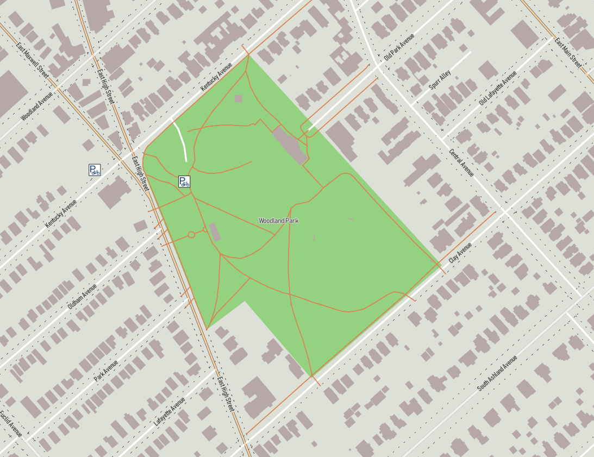
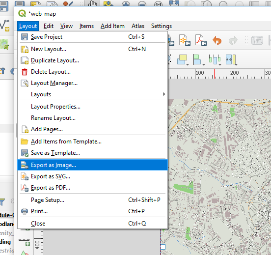
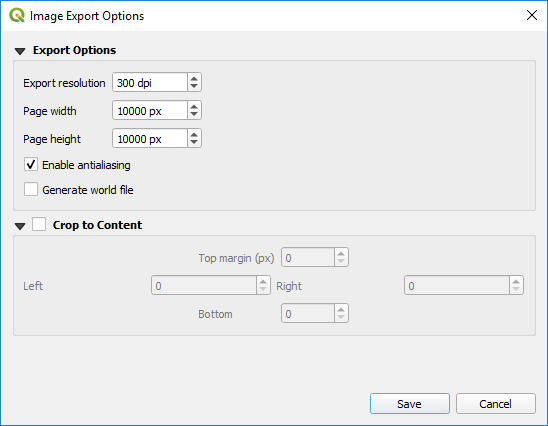
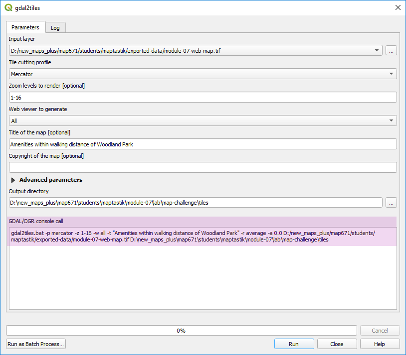
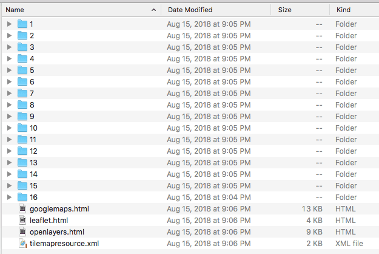

# Module 07 Lab Assignment

## Table of contents

<!-- TOC -->

- [Module 07 Lab Assignment](#module-07-lab-assignment)
    - [Table of contents](#table-of-contents)
    - [Part I: Trails and amenities with one mile of selected parks (10 pts)](#part-i-trails-and-amenities-with-one-mile-of-selected-parks-10-pts)
        - [Data files](#data-files)
    - [Required specifications of the deliverable](#required-specifications-of-the-deliverable)
        - [Tip: Tell a story about your city](#tip-tell-a-story-about-your-city)
    - [Challenge: Create a zoomable map of your analysis with gdal2tiles](#challenge-create-a-zoomable-map-of-your-analysis-with-gdal2tiles)
        - [Steps and procedures](#steps-and-procedures)
            - [Step 1: Export layout as georeferenced TIFF](#step-1-export-layout-as-georeferenced-tiff)
            - [Step 2: Use gedal2tiles to make zoomable map](#step-2-use-gedal2tiles-to-make-zoomable-map)
            - [Step 3: Inspect output](#step-3-inspect-output)
            - [Step 4: Publish tiles to web page](#step-4-publish-tiles-to-web-page)
        - [Example map](#example-map)
        - [Mega Challenge](#mega-challenge)

<!-- /TOC -->

## Part I: Trails and amenities with one mile of selected parks (10 pts)

The Institute of Environmental Recreation has hired you to find trails and amenities (cafes, restaurants, etc.) in your city's neighborhoods that are within walking distance (one mile) of public parks, forests, beaches, etc. They use QGIS and want to harvest OSM data with QuickOSM. As a deliverable, they want a good-looking, clean map that shows these locations to promote their **Play-Eat-Walk Local!** campaign to promote an active lifestyle in city neighborhoods.

We know OSM data is in the WGS84 CRS (EPSG: 4326), but we need to convert the spatial layers to a local CRS to perform geoprocessing. You should determine the local CRS that is suitable for your urban area.

### Data files

Use the OpenStreetMap data and styles you developed in the lesson. Other data sources might be required to complete the challenge.

## Required specifications of the deliverable

1) The final map must fulfill the following requirements:

>* Download all data from OpenStreetMap.
>* Find and show your desired amenities as point data
>* Show a one-mile mile buffer around the public parks of your choice. Use blending modes and transparency to better show overlapping polygons.
>* Symbolize roads by size and access, e.g, motorways are different than residential roads, using the Rule-based symbology style definition created in the lesson.
>* Parks and roads should have text labels for the features' name.
>* Symbolize streams, waterbodies, parks, and buildings if available.
>* Put your project in an appropriate local CRS.
>* Add appropriate title, legend, and scale.

When you zoom closely into your map, you should see something similar to the below image.

   
*Example of zoomed-in map view*


2) The client has requested a web page that shows the static map with link to a higher resolution version. This web page map must meet the following requirements:

>* Map needs to be in two resolutions: 1) width of 1,200 px and 2) width of 8,000 px
>* Map image format should be a PNG.
>* A link must be available to access the higher resolution version.
>* The web page must have must have a meaningful title and metadata about the author, data source, coordinate system, etc.
>* A brief description of your selected amenities and goal of the analysis.
>* Contact information in footer must be tuned to you, the author.
>* The map page must be called "index.html" in the _lab-07/map_ folder.


3) Commit often to save your progress. Submit the URL to lesson repository when you are complete.

### Tip: Tell a story about your city

Use the two-column web page template located in the _module-07/lesson-map_ to add additional elements like photographs, short paragraphs, and other content that helps a visitor appreciate your analysis.

## Challenge: Create a zoomable map of your analysis with gdal2tiles

Let's say you have a detailed, high-resolution map that you need to serve online efficiently and to a wider audience. The _Link to higher resolution_ that we use on our basic web page takes a lot of bandwidth to view and isn't particularly mobile friendly.

The GDAL library provides a function, **gdal2tiles**, to convert large images to thousands of raster tiles that the browser assembles for a selected extent and zoom level. This is the most basic slippy map where we can zoom and pan our image. More advanced slippy maps allow us to change feature symbols, labels by zoom level.

In this challenge, we'll not change the symbology and labels by zoom level. We'll convert a high-resolution map to a raster tile set that uses the [Leaflet.js](http://leafletjs.com/) mapping library to display the map in the browser at various zoom levels. (We'll use Leaflet library much more in the following course.)

### Steps and procedures

#### Step 1: Export layout as georeferenced TIFF

Before we use the **gdal2tiles** tool, we need to have a layout in *Layout Composer* ready for export. This might be the layout you created for the required portion of the lab. Let's export the image in the **TIFF** format at a higher resolution.

<br><br>
   
*Export a GeoTIFF at high resolution*

Make the resolution greater than 10,000 px in your long-edge dimension. Make sure not to cover too large of an extent (don't do New York City) because we can create a tile set many hundreds of MBs in size.

#### Step 2: Use gedal2tiles to make zoomable map

Now we have georeferenced TIFF image. Add that image as a new layer in Map Composer. This static image is what we'll use to create our zoomable map. Find the **gdal2tiles** tool in the QGIS *Processing Toolbox* under ** GDAL > Raster Miscellaneous > gdal2tiles**.

If you ran this with the tool with the default settings, it might work only OK. We will likely need to change the zoom range. Make you zoom levels no greater than 17 (higher is more zoomed in).

Make your output directory as the _lab-07/map-challenge/tiles_ directory. Your settings might look similar to:

   
*gdal2tiles settings*

Notice the magenta highlight. The _GDAL/OGR console call_ is the command we would use on the command line. This is helpful for scripting and automating these tasks.

#### Step 3: Inspect output

After export has completed, look in the _tiles_ directory and find a series of folders and a few HTML files. Each folder contains additional folders, each holding PNG images of a tiny section of your area. As the numbers increase, so does the scale. Look at an individual tile and see if you can recognize it's location.

   
*Contents of export folder*

Open one _leaflet.html_ in your browser. You should your map over an OpenStreetMap base map. You might want to increase the zoom levels if your text is too small.

Check the file size of the _tiles_ directory. If it's over 100 MB, then it is getting too large. You might need to shrink the extent of your georeferenced TIFF. Because each tile is small (256 px square), the individual tile file size is small enough that we don't break GitHub rules. Collectively, though, the project can be large. Each repository cannot be larger than 1 GB, so we need to find a balance between detail and project size.

If it looks good and the file size isn't too large, then let's publish the map.

#### Step 4: Publish tiles to web page

The linked resources in this _leaflet.html_ access non-secured URLs. We need _https_ resources. We have created two _html_ files in the _lab-07/map-challenge_ folder that we'll use instead of the HTML files produced by gdal2tiles.

In the _tiles.html_ file you'll need to find comments that you should change to appropriate values:

```javascript
<script>
    $(document).ready(function () {

      // ***!***
      // Change the initial view coordinates and zoom level to match your map
      //***!***
      var map = L.map('map').setView([38.00, -84.50], 14);

      //***!***
      // Change the L.tileLayer(path/to/tiles/{z}/{x}/{y}.png) property
      // Should work as is if you didn't change names or create extra folders
      //***!***
      var mytile = L.tileLayer('tiles/{z}/{x}/{y}.png', {
        maxZoom: 16,
        tms: true,
        attribution: 'Generated by gdal2tiles'
      }).addTo(map);

      // ***!*** Nothing else to change

      // Below code block adds a geolocation tool and scale.
      // Stay tuned for Map 672 for more!
      // Use the geolocate plugin!
        var locate_options = {
        watch: true,
        enableHighAccuracy: true,
        position: 'topleft'
      };
      L.control.locate(locate_options).addTo(map); // add the tool to the map

      L.control.scale().addTo(map); // maps like this need scales, yo!

    })
  </script>
```

**Don't change anything else in this file**. Now open the _index.html_ file and change the following (if necessary):

```html
<h1>Lexington Parks</h1>

<!-- Use the iframe tag (inline web page frame) to show your slippy map -->

<iframe src="tiles.html" width="100%" height="640px"></iframe>

```

### Example map

This is a full-screen example created for a local art fair in a park for August 18-20. It uses the gdal2tiles tool to make the zoomable base map and adds GeoJSON elements for interactivity. This will be revisited extensively in Map 672! Stay tuned.

https://outragegis.com/maps/fair/

### Mega Challenge

Add summary statistics to your page the describes how many trails and amenities are within distance of your favorite public parks. Leverage the SQL 'GROUP BY' clause to sum the miles of trail or count the number of amenities within distance of each park.
